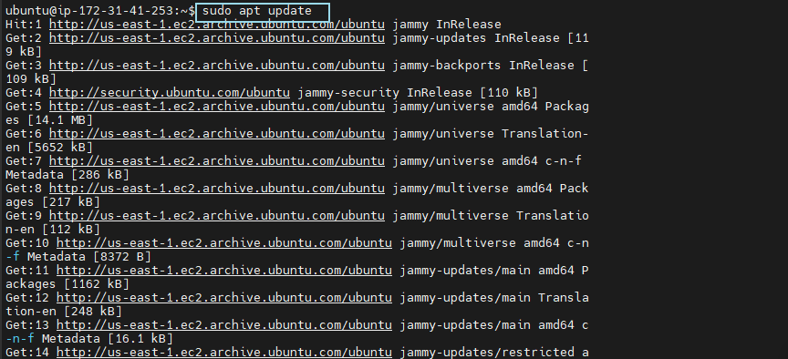
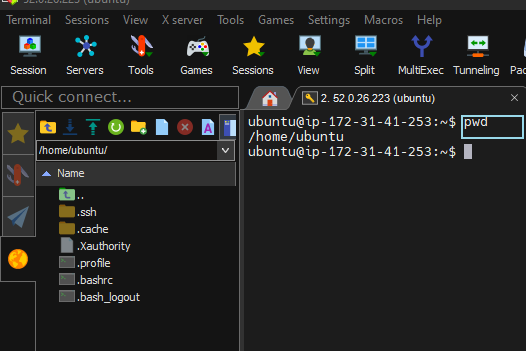
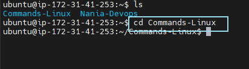
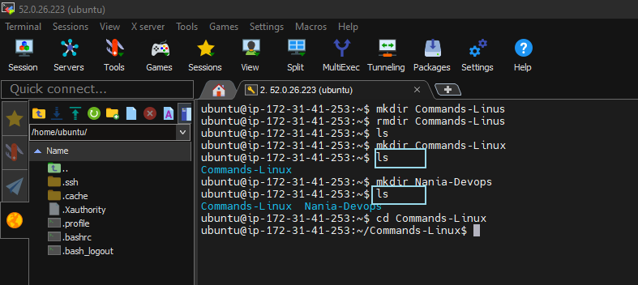
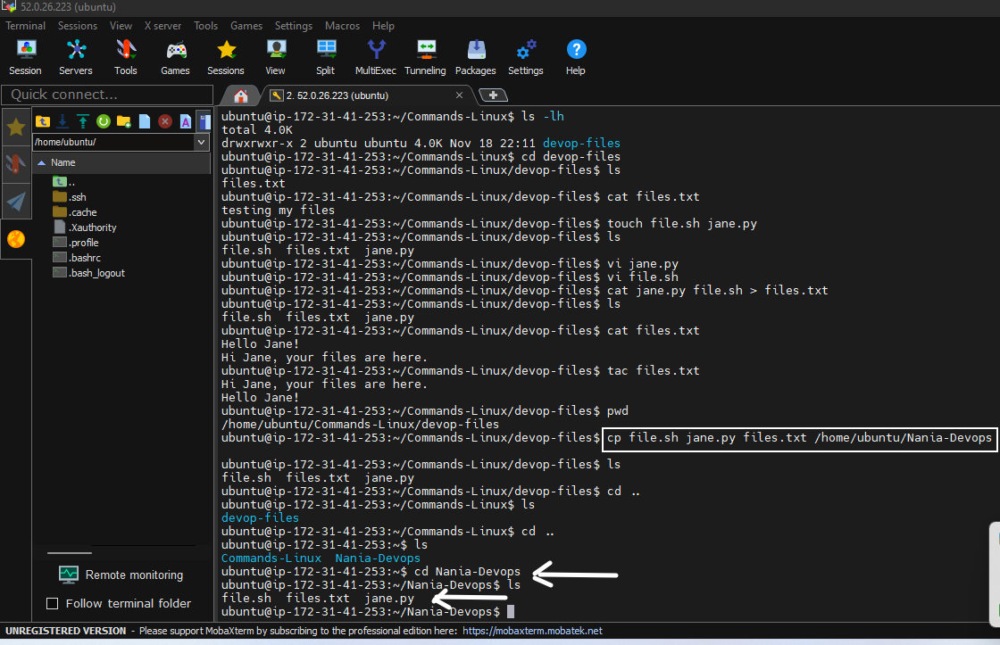
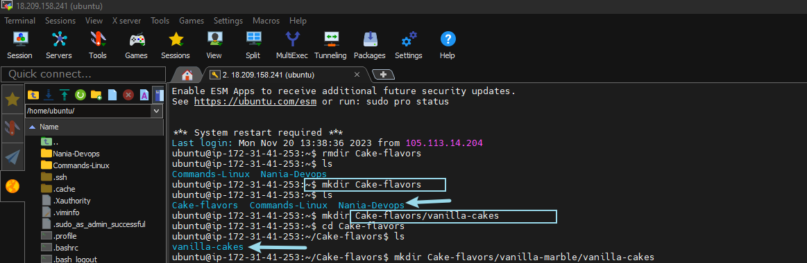
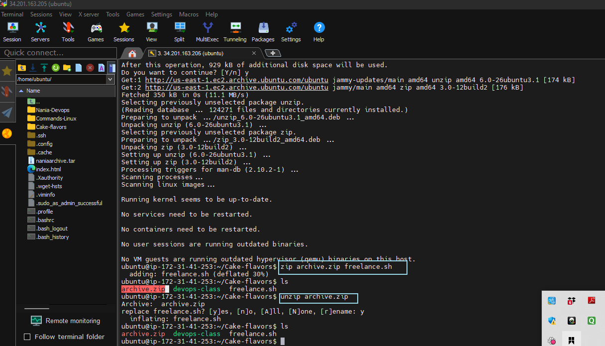

# Linux-project
## Documentation of some Linux commands
### SUDO COMMAND

The `sudo` command allows users to execute specific commands with elevated privileges, enabling them to perform administrative tasks without logging in as the superuser. To use the sudo command, you use the following syntax `sudo apt upgrade`

### PWD

This means `Present Working Directory`. and is used to display the current directory path in the command line interface. So use the syntax `pwd`.

### CD

The `cd` command in a command-line interface is used to `change` the current working `directory` to the specified location. So use the syntax `cd`.

### LS

The "ls" command in a command-line interface is used to `list` the files and directories in the current working directory. You use the syntax `ls`.

### LS -L

The `ls -l` command in a command-line interface is used to display detailed information about files and directories, including permissions, ownership, size, and modification time.

### LS -R

The `ls -R` command in a command-line interface is used to recursively list files and directories, including those in subdirectories, providing a comprehensive view of the entire directory tree.

### LS -LH

The `ls -lh` command in a command-line interface is used to list files and directories with detailed information, including human-readable file sizes, using appropriate unit suffixes (e.g., KB, MB).

### CAT

The `cat` command in a command-line interface is used to concatenate and display the contents of one or more files. Use the syntax `cat`.

#### CAT also merges filename1.txt and filename2.txt and merges the output in > filename3.txt

#### TAC `tac filename.txt`displays content in reverse order.

### CP COMMAND

The `cp` command in a command-line interface is used to copy files or directories from one location to another. So to copy files to a directory, enter the filenames followed by the destination directory. You us the syntax `cp`.

### MV COMMAND

The `mv` command in Linux is used to move or rename files and directories. You use the syntax `mv`.

### MKDIR COMMAND

The `mkdir` command in Linux is used to create a new directory or folder.
It also allows users to create parent directories if they do not exist using the `-p` option, and it can set permissions for the newly created directory.

### RMDIR

The `rmdir` command in Linux is used to remove empty directories or folders. The `rmdir` command typically only removes empty directories, and it does not remove directories with content; for removing directories with content, the rm command with the `-r (or --recursive)` option is commonly used. The `-p` option with the rmdir command in Linux allows the removal of `parent` directories as well, and it automatically removes any empty parent directories if the specified directory is successfully removed.

### RM COMMAND

The `rm` command in Linux is used to remove or delete files and directories.

### TOUCH COMMAND

The `touch` command in Linux is used to create empty files, update access and modification timestamps of existing files, or set specific timestamp values.

### LOCATE COMMAND

The `locate` command in Linux is used to quickly find the location of files by searching an indexed database of file names on the system. Passing the `-i` argument will turn of case sensitivity, so you can search for a file even if you don't remember its exact name. You can use the syntax `locate -i`.

### FIND COMMAND

The `find` command in Linux is used to search for files and directories in a directory hierarchy based on various criteria such as name, type, size, and time. You use the syntax `find`.

### GREP COMMAND

The `grep` command in Linux is used for searching and printing lines that match a specified pattern in a text file or output.

### DF COMMAND

The `df` command in Linux is used for displaying information about disk space usage, including the total, used, and available space on file systems.

### DU COMMAND

The `du command`in Linux is used for estimating and displaying the disk space usage of files and directories in a specified location. To use this command, you have to specify the directory path for example `du /home/ubuntu/Cake-flavors`

### HEAD COMMAND

The `head` command in Linux is used for displaying the first few lines of a text file or input, allowing users to preview the beginning of the content.

### TAIL COMMAND

The `tail command` in Linux is used for displaying the last few lines of a text file or input, enabling users to preview the end of the content, which is particularly useful for monitoring logs in real-time.

### DIFF COMMAND

The `diff` command in Linux is used to compare and display the differences between two text files.

### TAR COMMAND

The `tar` command in Linux is used to archive and compress multiple files or directories into a single file.

### CHMOD COMMAND

The `chmod` command in Linux is used to change the permissions (read, write, execute) of files and directories.

### CHOWN COMMAND

The `chown` command in Linux is used to change the ownership of files and directories, assigning them to a specified user and/or group.

### JOBS COMMAND

The `jobs` command in Linux is used to display a list of all background jobs that are currently running in the shell session. You input the syntax  `&` at the end of the command to run it in the background.

### KILL COMMAND

In Linux, the `kill` command is used to terminate or signal processes. It allows you to send signals to processes, and two common signals are `SIGTERM` and `SIGKILL`. 
When a process receives SIGTERM, it has an opportunity to perform cleanup operations before shutting down. It allows the process to release resources and exit gracefully.
When a process receives SIGKILL, it is immediately terminated without any chance to clean up or save its state. It is often used when a process is unresponsive or refuses to terminate through SIGTERM.

### PING COMMAND

The `ping` command in Linux is used to send a network request to a specific IP address or hostname to check if the target host is reachable and to measure the round-trip time for packets to travel from the source to the destination and back. The basic syntax of the ping command is: `ping [options] destination`. For example: `ping google.com`

### WGET COMMAND

The `wget` command in Linux is a utility for non-interactive downloading files from the web. It allows you to retrieve files from the internet using HTTP, HTTPS, and FTP protocols. Here is a basic syntax of the wget command:
`wget [options] [URL]`

The `uname` command is a Unix and Unix-like operating system command that provides information about the system. When you run the `uname` command without any options or arguments, it typically displays the system name, kernel name, kernel release, kernel version, machine hardware name, and processor type.

### TOP COMMAND

The `top` command in Linux provides real-time information about system resource usage, displaying a dynamic and interactive overview of running processes.

### HISTORY COMMAND

The `history` command in Linux displays a list of previously executed shell commands in the terminal session.

### MAN COMMAND

The "man" command in Linux is used to display the manual pages for other commands, providing detailed information and documentation on their usage, options, and functionalities. so you can run the syntax `man ls`. This command would display the manual page for the "ls" command, showing information about how to use it and its various options.

### ECHO COMMAND

The `echo` command in Linux is used to display text or output to the terminal. It takes the text or strings as arguments and prints them to the standard output (usually the terminal). It is commonly used in shell scripts and the command line for various purposes, such as printing messages, setting variables, or generating output.
This command will output the text "Hello, Jane!" to the terminal. Additionally, you can use the echo command with variables, escape characters, or special options for more complex text manipulation.

### ZIP,UNZIP COMMANDS

In Linux, the `zip` command compresses files into a zip archive, while the `unzip` command extracts files from a zip archive, offering a straightforward way to manage file compression and decompression tasks.

### HOSTNAME COMMAND

In Linux, the `hostname` command is used to display or set the system's host name, which is the unique identifier assigned to a computer on a network.

### USERADD,USERDEL COMMANDS

`USERADD`: This command creates a new user account with the specified username. Options can be used to set details such as the user's home directory, login shell, initial login group, additional groups, and password.Syntax is useradd [options] username e.g useradd Nania.

`USERDEL` This command removes a user account from the system. The -r option can be used to delete the user's home directory and mail spool along with the account. Deleting a user with userdel does not delete the user's files unless the -r option is used.

`Note that both commands requires sudo priviledges to run.`

### APT-GET COMMAND

The `apt-get` command in Linux is a package management tool used primarily in Debian and Ubuntu-based systems to handle the installation, upgrading, configuration, and removal of software packages. It is a command-line interface for the Advanced Package Tool (APT) system.

### NANO,VI,JED COMMANDS

`Nano, Vi, and Jed` commands in Linux are used to manipulate and edit text files efficiently, providing users with a range of options from basic text editing (Nano) to more advanced and versatile capabilities (Vi and Jed).

"After using Nano to quickly edit a configuration file, I switched to Vi to make some advanced changes, and finally, I turned to Jed for its user-friendly interface to fine-tune the document."

### ALIAS UNALIAS COMMAND

In Linux, the alias and unalias commands are used to create and manage command aliases. An alias is a short name or abbreviation assigned to a longer command or set of commands, making it easier to remember and use frequently executed commands. Here's a brief overview:

1. `Alias Command`:
To create an alias, you can use the alias command followed by the alias name and the command you want to associate with it. The basic syntax is:
 `alias alias_name='command'`

 For example, let's say you want to create an alias named "ll" for the ls -l command:
 `alias ll='ls -l'

Now, whenever you type `ll` in the terminal, it will execute the    `ls -l command.`

To remove an alias, you can use the `unalias` command followed by the `alias name`. The syntax is:
`unalias alias_name`.

For example, to remove the `"ll"` alias we created earlier: We use the syntax `unalias ll`. Now, typing `ll` will not be recognized as an alias anymore.

### SU COMMAND

The su command in Linux stands for "switch user" or "substitute user." It allows you to switch to another user account or become a superuser (root) if no specific user is specified. The su command is often used in terminal sessions to perform administrative tasks that require elevated privileges.

### HTOP COMMAND

`htop` is a command-line utility in Linux used for viewing and managing system processes in real-time. It provides a more user-friendly and interactive interface compared to the traditional top command.

### PS COMMAND

The `ps` command in Linux and Unix-like operating systems is used to provide information about the currently running processes. It displays information such as process IDs (PIDs), terminal associated with the process, CPU and memory usage, and more.

